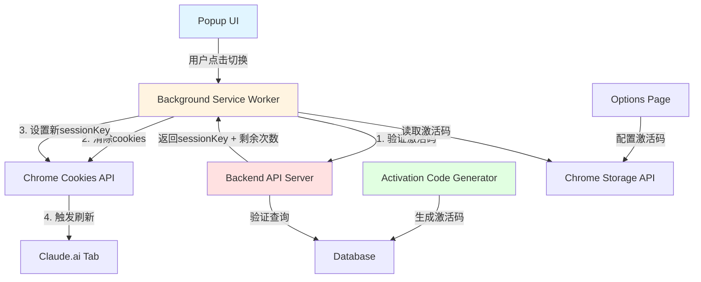
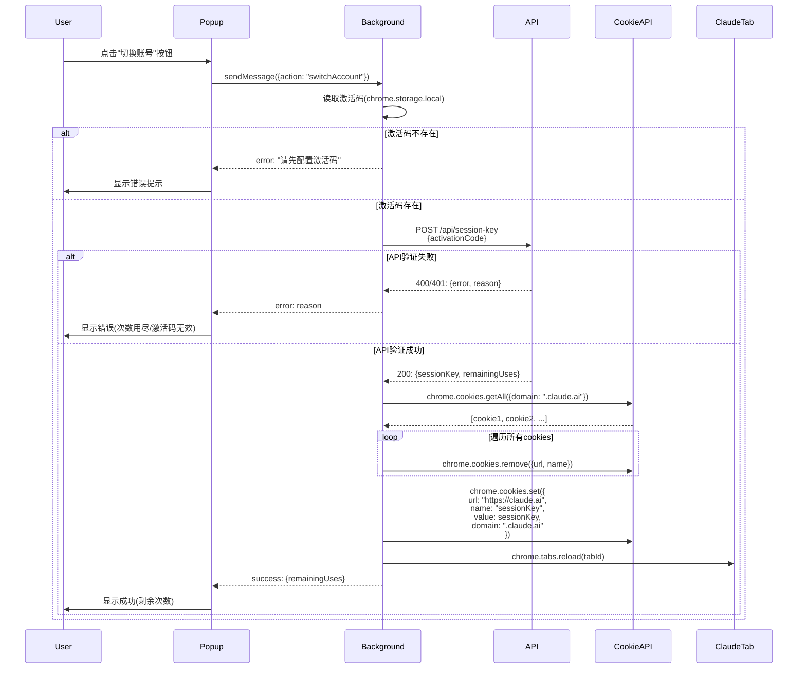
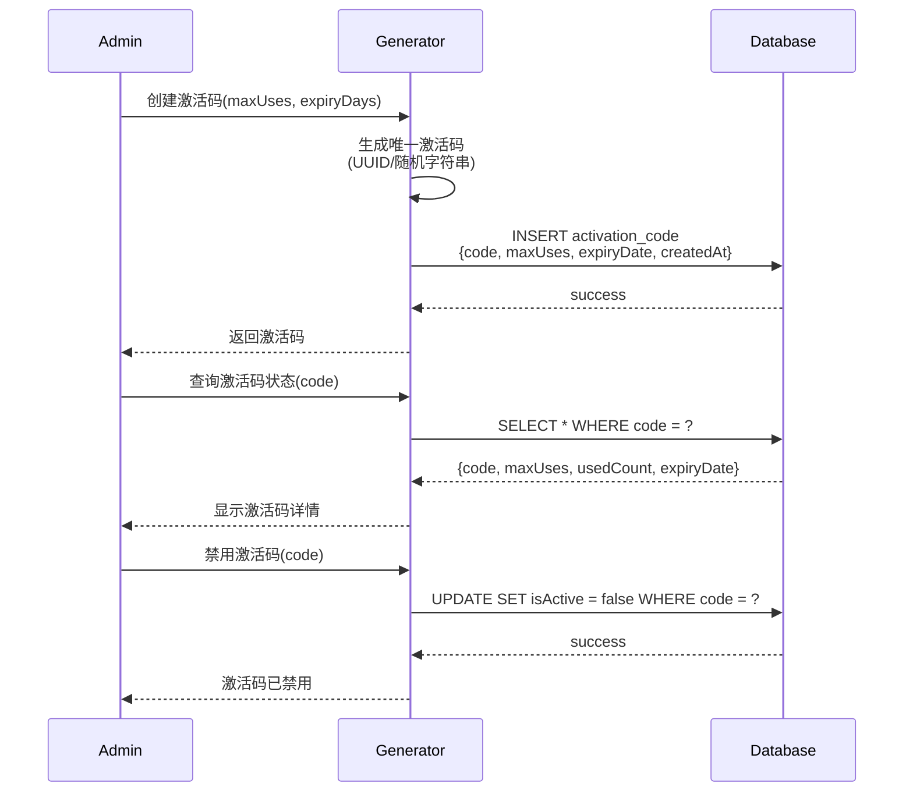
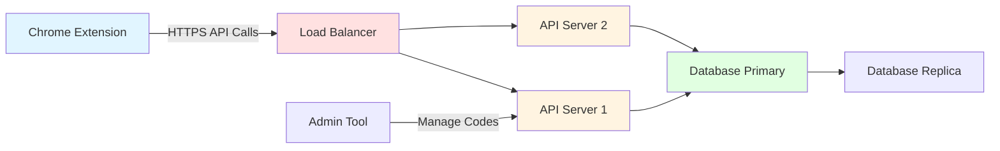

# Design Document: Claude Account Switcher Chrome Extension

## Overview

Chrome浏览器扩展,实现Claude账号一键切换功能。核心机制是通过激活码验证的后端接口获取sessionKey,清除claude.ai域的现有cookies,注入新的sessionKey cookie,并自动刷新页面完成账号切换。扩展包含激活码验证、次数限制、错误处理等完整功能,配套提供激活码生成管理工具。

该扩展采用Chrome Extension Manifest V3架构,使用background service worker处理cookie操作,popup UI提供用户交互界面,通过RESTful API与后端激活码验证服务通信。

## Architecture



## Sequence Diagrams

### Account Switching Flow




### Activation Code Generation Flow



## Components and Interfaces

### Component 1: Popup UI

**Purpose**: 用户交互界面,提供账号切换按钮、状态显示、激活码配置入口

**Interface**:
```typescript
interface PopupController {
  // 初始化Popup界面
  initialize(): Promise<void>
  
  // 处理切换账号按钮点击
  handleSwitchAccount(): Promise<void>
  
  // 更新UI状态显示
  updateStatus(status: SwitchStatus): void
  
  // 打开配置页面
  openOptions(): void
}

interface SwitchStatus {
  success: boolean
  message: string
  remainingUses?: number
}
```


**Responsibilities**:
- 渲染用户界面(切换按钮、状态提示、剩余次数)
- 监听用户交互事件(按钮点击)
- 与Background Service Worker通信
- 更新界面状态(加载中、成功、失败)
- 提供激活码配置入口

### Component 2: Background Service Worker

**Purpose**: 核心业务逻辑处理,执行cookie操作、API调用、状态管理

**Interface**:
```typescript
interface BackgroundService {
  // 处理来自Popup的消息
  handleMessage(message: Message, sender: chrome.runtime.MessageSender): Promise<MessageResponse>
  
  // 执行账号切换逻辑
  switchAccount(activationCode: string): Promise<SwitchResult>
  
  // 清除Claude域的所有cookies
  clearClaudeCookies(): Promise<void>
  
  // 设置新的sessionKey cookie
  setSessionKeyCookie(sessionKey: string): Promise<void>
  
  // 刷新Claude标签页
  refreshClaudeTabs(): Promise<void>
}

interface Message {
  action: 'switchAccount' | 'getStatus'
  payload?: any
}

interface MessageResponse {
  success: boolean
  data?: any
  error?: string
}

interface SwitchResult {
  success: boolean
  sessionKey?: string
  remainingUses?: number
  error?: string
}
```

**Responsibilities**:
- 监听来自Popup和Options的消息
- 调用后端API验证激活码并获取sessionKey
- 使用Chrome Cookies API清除和设置cookies
- 管理扩展状态(激活码、使用次数)
- 错误处理和重试逻辑
- 刷新Claude标签页


### Component 3: Backend API Server

**Purpose**: 激活码验证、sessionKey生成、使用次数管理

**Interface**:
```typescript
interface APIServer {
  // 验证激活码并返回sessionKey
  POST_getSessionKey(request: SessionKeyRequest): Promise<SessionKeyResponse>
  
  // 查询激活码状态(管理端)
  GET_activationCodeStatus(code: string): Promise<ActivationCodeStatus>
  
  // 创建新激活码(管理端)
  POST_createActivationCode(request: CreateCodeRequest): Promise<CreateCodeResponse>
  
  // 禁用激活码(管理端)
  POST_disableActivationCode(code: string): Promise<void>
}

interface SessionKeyRequest {
  activationCode: string
}

interface SessionKeyResponse {
  success: boolean
  sessionKey?: string
  remainingUses?: number
  error?: string
  reason?: 'invalid_code' | 'expired' | 'no_uses_left' | 'disabled'
}

interface ActivationCodeStatus {
  code: string
  maxUses: number
  usedCount: number
  remainingUses: number
  expiryDate: string
  isActive: boolean
  createdAt: string
}

interface CreateCodeRequest {
  maxUses: number
  expiryDays: number
}

interface CreateCodeResponse {
  code: string
  maxUses: number
  expiryDate: string
}
```

**Responsibilities**:
- 验证激活码有效性(存在性、过期时间、激活状态)
- 检查使用次数限制
- 生成或获取sessionKey
- 更新使用次数
- 记录使用日志
- 提供管理端API(创建、查询、禁用激活码)


### Component 4: Options Page

**Purpose**: 激活码配置界面

**Interface**:
```typescript
interface OptionsController {
  // 初始化配置页面
  initialize(): Promise<void>
  
  // 保存激活码
  saveActivationCode(code: string): Promise<void>
  
  // 加载当前激活码
  loadActivationCode(): Promise<string | null>
  
  // 验证激活码格式
  validateCodeFormat(code: string): boolean
}
```

**Responsibilities**:
- 提供激活码输入和保存界面
- 验证激活码格式
- 使用chrome.storage.local存储激活码
- 显示配置成功/失败状态

### Component 5: Activation Code Generator Tool

**Purpose**: 独立工具,用于生成和管理激活码

**Interface**:
```typescript
interface CodeGenerator {
  // 生成唯一激活码
  generateCode(length?: number): string
  
  // 创建激活码记录
  createActivationCode(maxUses: number, expiryDays: number): Promise<string>
  
  // 查询激活码列表
  listActivationCodes(filters?: CodeFilters): Promise<ActivationCodeStatus[]>
  
  // 禁用激活码
  disableCode(code: string): Promise<void>
  
  // 导出激活码
  exportCodes(format: 'csv' | 'json'): Promise<string>
}

interface CodeFilters {
  isActive?: boolean
  expiryDateFrom?: string
  expiryDateTo?: string
}
```

**Responsibilities**:
- 生成唯一随机激活码
- 与数据库交互(创建、查询、更新激活码)
- 提供命令行或Web界面
- 激活码批量管理
- 导出激活码列表


## Data Models

### Model 1: ActivationCode

```typescript
interface ActivationCode {
  id: number
  code: string              // 唯一激活码
  maxUses: number          // 最大使用次数
  usedCount: number        // 已使用次数
  expiryDate: string       // 过期时间(ISO 8601)
  isActive: boolean        // 是否激活状态
  createdAt: string        // 创建时间(ISO 8601)
  lastUsedAt: string | null // 最后使用时间(ISO 8601)
}
```

**Validation Rules**:
- `code` must be unique, non-empty string, 16-32 characters
- `maxUses` must be positive integer, typically 1-1000
- `usedCount` must be non-negative integer, <= maxUses
- `expiryDate` must be valid ISO 8601 date, >= createdAt
- `isActive` defaults to true
- `createdAt` auto-set to current timestamp
- `lastUsedAt` nullable, auto-updated on each use

### Model 2: UsageLog

```typescript
interface UsageLog {
  id: number
  activationCode: string   // 关联的激活码
  usedAt: string          // 使用时间(ISO 8601)
  ipAddress: string       // 用户IP地址
  userAgent: string       // 浏览器User-Agent
  success: boolean        // 是否成功
  errorReason?: string    // 失败原因
}
```

**Validation Rules**:
- `activationCode` must reference valid ActivationCode.code
- `usedAt` auto-set to current timestamp
- `ipAddress` must be valid IPv4/IPv6 format
- `userAgent` non-empty string
- `success` boolean, defaults to false
- `errorReason` required if success is false


### Model 3: ExtensionConfig

```typescript
interface ExtensionConfig {
  activationCode: string | null  // 用户配置的激活码
  apiEndpoint: string           // 后端API地址
  lastSwitchTime: string | null // 最后切换时间
  remainingUses: number | null  // 剩余使用次数(缓存)
}
```

**Validation Rules**:
- `activationCode` nullable, 16-32 characters when set
- `apiEndpoint` must be valid HTTPS URL
- `lastSwitchTime` nullable ISO 8601 timestamp
- `remainingUses` nullable positive integer

### Model 4: SessionKeyCookie

```typescript
interface SessionKeyCookie {
  name: string      // cookie名称: "sessionKey"
  value: string     // sessionKey值
  domain: string    // ".claude.ai"
  path: string      // "/"
  secure: boolean   // true
  httpOnly: boolean // true
  sameSite: 'lax' | 'strict' | 'none'
  expirationDate?: number  // Unix timestamp
}
```

**Validation Rules**:
- `name` must be exactly "sessionKey"
- `value` non-empty string, typically JWT or UUID format
- `domain` must be ".claude.ai"
- `path` must be "/"
- `secure` must be true (HTTPS only)
- `httpOnly` recommended true for security
- `sameSite` recommended 'lax' or 'strict'
- `expirationDate` optional, Unix timestamp in seconds

## Algorithmic Pseudocode

### Main Account Switching Algorithm

```typescript
/**
 * 账号切换主流程算法
 * 
 * INPUT: activationCode (string) - 用户的激活码
 * OUTPUT: SwitchResult - 包含成功状态、sessionKey和剩余次数
 * 
 * PRECONDITIONS:
 * - activationCode is non-empty string
 * - Chrome extension has cookies permission
 * - API endpoint is configured and reachable
 * 
 * POSTCONDITIONS:
 * - If successful: claude.ai cookies are cleared and new sessionKey is set
 * - If successful: usedCount is incremented in database
 * - If failed: no cookies are modified
 * - remainingUses is returned or cached
 */
async function switchAccount(activationCode: string): Promise<SwitchResult> {
  // Step 1: Validate input
  ASSERT activationCode !== null && activationCode.length >= 16
  
  try {
    // Step 2: Call API to verify activation code and get sessionKey
    const apiResponse = await fetch(API_ENDPOINT + '/api/session-key', {
      method: 'POST',
      headers: { 'Content-Type': 'application/json' },
      body: JSON.stringify({ activationCode })
    })
    
    // Step 3: Handle API response
    if (!apiResponse.ok) {
      const errorData = await apiResponse.json()
      return {
        success: false,
        error: errorData.error || 'API request failed',
        reason: errorData.reason
      }
    }
    
    const { sessionKey, remainingUses } = await apiResponse.json()
    ASSERT sessionKey !== null && sessionKey.length > 0
    ASSERT remainingUses >= 0
    
    // Step 4: Clear all claude.ai cookies
    await clearClaudeCookies()
    
    // Step 5: Set new sessionKey cookie
    await setSessionKeyCookie(sessionKey)
    
    // Step 6: Refresh Claude tabs
    await refreshClaudeTabs()
    
    // Step 7: Update local cache
    await chrome.storage.local.set({
      lastSwitchTime: new Date().toISOString(),
      remainingUses: remainingUses
    })
    
    return {
      success: true,
      sessionKey: sessionKey,
      remainingUses: remainingUses
    }
    
  } catch (error) {
    return {
      success: false,
      error: error.message || 'Unknown error occurred'
    }
  }
}
```


### Cookie Clearing Algorithm

```typescript
/**
 * 清除Claude域的所有cookies算法
 * 
 * INPUT: None
 * OUTPUT: Promise<void>
 * 
 * PRECONDITIONS:
 * - Chrome extension has cookies permission for https://claude.ai
 * 
 * POSTCONDITIONS:
 * - All cookies for domain .claude.ai and claude.ai are removed
 * - No other domain cookies are affected
 * 
 * LOOP INVARIANTS:
 * - All previously processed cookies have been successfully removed
 */
async function clearClaudeCookies(): Promise<void> {
  // Get all cookies for claude.ai domain
  const cookies = await chrome.cookies.getAll({
    domain: 'claude.ai'
  })
  
  ASSERT Array.isArray(cookies)
  
  // Remove each cookie
  for (const cookie of cookies) {
    ASSERT cookie.name !== null && cookie.domain !== null
    
    const url = `https://${cookie.domain.startsWith('.') ? 'www' : ''}${cookie.domain}${cookie.path}`
    
    await chrome.cookies.remove({
      url: url,
      name: cookie.name
    })
  }
  
  // Verify all cookies are removed
  const remainingCookies = await chrome.cookies.getAll({ domain: 'claude.ai' })
  ASSERT remainingCookies.length === 0
}
```

### SessionKey Cookie Setting Algorithm

```typescript
/**
 * 设置sessionKey cookie算法
 * 
 * INPUT: sessionKey (string) - 从API获取的sessionKey
 * OUTPUT: Promise<void>
 * 
 * PRECONDITIONS:
 * - sessionKey is non-empty string
 * - Chrome extension has cookies permission for https://claude.ai
 * 
 * POSTCONDITIONS:
 * - sessionKey cookie is set for .claude.ai domain
 * - Cookie is secure, httpOnly, and properly configured
 */
async function setSessionKeyCookie(sessionKey: string): Promise<void> {
  ASSERT sessionKey !== null && sessionKey.length > 0
  
  const cookieDetails = {
    url: 'https://claude.ai',
    name: 'sessionKey',
    value: sessionKey,
    domain: '.claude.ai',
    path: '/',
    secure: true,
    httpOnly: true,
    sameSite: 'lax' as chrome.cookies.SameSiteStatus,
    expirationDate: Math.floor(Date.now() / 1000) + (30 * 24 * 60 * 60) // 30 days
  }
  
  const result = await chrome.cookies.set(cookieDetails)
  
  ASSERT result !== null
  ASSERT result.name === 'sessionKey'
  ASSERT result.value === sessionKey
}
```


### Activation Code Validation Algorithm (Backend)

```typescript
/**
 * 激活码验证算法(后端)
 * 
 * INPUT: activationCode (string) - 待验证的激活码
 * OUTPUT: ValidationResult - 验证结果和sessionKey
 * 
 * PRECONDITIONS:
 * - activationCode is non-empty string
 * - Database connection is established
 * 
 * POSTCONDITIONS:
 * - If valid: usedCount is incremented by 1
 * - If valid: lastUsedAt is updated to current timestamp
 * - If valid: usage log is created
 * - If invalid: no database changes occur
 */
async function validateActivationCode(
  activationCode: string
): Promise<SessionKeyResponse> {
  ASSERT activationCode !== null && activationCode.length >= 16
  
  // Step 1: Query activation code from database
  const codeRecord = await db.query(
    'SELECT * FROM activation_codes WHERE code = ?',
    [activationCode]
  )
  
  // Step 2: Check if code exists
  if (codeRecord.length === 0) {
    return {
      success: false,
      error: 'Invalid activation code',
      reason: 'invalid_code'
    }
  }
  
  const code = codeRecord[0]
  
  // Step 3: Check if code is active
  if (!code.isActive) {
    await logUsage(activationCode, false, 'disabled')
    return {
      success: false,
      error: 'Activation code is disabled',
      reason: 'disabled'
    }
  }
  
  // Step 4: Check if code is expired
  const now = new Date()
  const expiryDate = new Date(code.expiryDate)
  if (now > expiryDate) {
    await logUsage(activationCode, false, 'expired')
    return {
      success: false,
      error: 'Activation code has expired',
      reason: 'expired'
    }
  }
  
  // Step 5: Check remaining uses
  if (code.usedCount >= code.maxUses) {
    await logUsage(activationCode, false, 'no_uses_left')
    return {
      success: false,
      error: 'No remaining uses for this activation code',
      reason: 'no_uses_left'
    }
  }
  
  // Step 6: Generate or retrieve sessionKey
  const sessionKey = await generateSessionKey()
  ASSERT sessionKey !== null && sessionKey.length > 0
  
  // Step 7: Update usage count
  await db.query(
    'UPDATE activation_codes SET usedCount = usedCount + 1, lastUsedAt = ? WHERE code = ?',
    [now.toISOString(), activationCode]
  )
  
  // Step 8: Log successful usage
  await logUsage(activationCode, true, null)
  
  // Step 9: Return result
  const remainingUses = code.maxUses - code.usedCount - 1
  ASSERT remainingUses >= 0
  
  return {
    success: true,
    sessionKey: sessionKey,
    remainingUses: remainingUses
  }
}
```


### Activation Code Generation Algorithm

```typescript
/**
 * 激活码生成算法
 * 
 * INPUT: 
 *   - maxUses (number) - 最大使用次数
 *   - expiryDays (number) - 有效天数
 * OUTPUT: string - 生成的唯一激活码
 * 
 * PRECONDITIONS:
 * - maxUses is positive integer
 * - expiryDays is positive integer
 * 
 * POSTCONDITIONS:
 * - Generated code is unique in database
 * - Activation code record is created in database
 * - Generated code matches format requirements (16-32 characters)
 * 
 * LOOP INVARIANTS:
 * - Each iteration generates a unique candidate code
 */
async function createActivationCode(
  maxUses: number,
  expiryDays: number
): Promise<string> {
  ASSERT maxUses > 0 && Number.isInteger(maxUses)
  ASSERT expiryDays > 0 && Number.isInteger(expiryDays)
  
  let code: string
  let isUnique = false
  let attempts = 0
  const MAX_ATTEMPTS = 10
  
  // Generate unique code with retry logic
  while (!isUnique && attempts < MAX_ATTEMPTS) {
    // Generate random code (format: XXXX-XXXX-XXXX-XXXX)
    code = generateRandomCode(16)
    ASSERT code.length === 19 // 16 chars + 3 hyphens
    
    // Check uniqueness
    const existing = await db.query(
      'SELECT code FROM activation_codes WHERE code = ?',
      [code]
    )
    
    isUnique = existing.length === 0
    attempts++
  }
  
  if (!isUnique) {
    throw new Error('Failed to generate unique activation code after ' + MAX_ATTEMPTS + ' attempts')
  }
  
  // Calculate expiry date
  const now = new Date()
  const expiryDate = new Date(now.getTime() + expiryDays * 24 * 60 * 60 * 1000)
  
  // Insert into database
  await db.query(
    'INSERT INTO activation_codes (code, maxUses, usedCount, expiryDate, isActive, createdAt) VALUES (?, ?, ?, ?, ?, ?)',
    [code, maxUses, 0, expiryDate.toISOString(), true, now.toISOString()]
  )
  
  return code
}

/**
 * 生成随机激活码字符串
 */
function generateRandomCode(length: number): string {
  const chars = 'ABCDEFGHJKLMNPQRSTUVWXYZ23456789' // 去除易混淆字符(I,O,0,1)
  let code = ''
  
  for (let i = 0; i < length; i++) {
    if (i > 0 && i % 4 === 0) {
      code += '-'
    }
    const randomIndex = Math.floor(Math.random() * chars.length)
    code += chars[randomIndex]
  }
  
  return code
}
```


## Key Functions with Formal Specifications

### Function 1: chrome.cookies.getAll()

```typescript
async function getAllClaudeCookies(): Promise<chrome.cookies.Cookie[]>
```

**Preconditions:**
- Chrome extension has `cookies` permission in manifest
- `host_permissions` includes `https://claude.ai/*`

**Postconditions:**
- Returns array of Cookie objects (may be empty)
- Each Cookie object has valid name, value, domain, path properties
- No side effects on cookies

**Loop Invariants:** N/A

### Function 2: chrome.cookies.remove()

```typescript
async function removeCookie(url: string, name: string): Promise<chrome.cookies.Cookie | null>
```

**Preconditions:**
- `url` is valid HTTPS URL matching cookie's domain
- `name` is non-empty string
- Chrome extension has cookies permission

**Postconditions:**
- If cookie exists: cookie is removed and returned
- If cookie doesn't exist: returns null
- Only specified cookie is affected

**Loop Invariants:** N/A

### Function 3: chrome.cookies.set()

```typescript
async function setCookie(details: chrome.cookies.SetDetails): Promise<chrome.cookies.Cookie>
```

**Preconditions:**
- `details.url` is valid HTTPS URL
- `details.name` is non-empty string
- `details.value` is string
- Chrome extension has cookies permission

**Postconditions:**
- Cookie is created or updated
- Returns the created Cookie object
- Cookie is immediately accessible via chrome.cookies.get()

**Loop Invariants:** N/A

### Function 4: chrome.tabs.reload()

```typescript
async function reloadTab(tabId: number, options?: chrome.tabs.ReloadProperties): Promise<void>
```

**Preconditions:**
- `tabId` is valid tab ID
- Tab exists and is not closed
- Chrome extension has `tabs` permission

**Postconditions:**
- Tab is reloaded with new cookies
- Page state is reset
- No return value (void)

**Loop Invariants:** N/A


### Function 5: validateActivationCode() (Backend)

```typescript
async function validateActivationCode(code: string): Promise<SessionKeyResponse>
```

**Preconditions:**
- `code` is non-null, non-empty string
- Database connection is established
- `activation_codes` table exists

**Postconditions:**
- If valid: returns SessionKeyResponse with success=true, sessionKey, remainingUses
- If valid: usedCount incremented by 1 in database
- If valid: lastUsedAt updated to current timestamp
- If invalid: returns SessionKeyResponse with success=false, error, reason
- If invalid: no database modifications occur
- Usage log is created regardless of validation result

**Loop Invariants:** N/A

### Function 6: generateSessionKey() (Backend)

```typescript
async function generateSessionKey(): Promise<string>
```

**Preconditions:**
- No specific preconditions (this may call external Claude API or generate JWT)

**Postconditions:**
- Returns non-empty string representing valid sessionKey
- SessionKey is compatible with Claude.ai authentication
- SessionKey has appropriate expiration time

**Loop Invariants:** N/A

### Function 7: chrome.storage.local.get()

```typescript
async function getStorageData(keys: string | string[]): Promise<{[key: string]: any}>
```

**Preconditions:**
- Chrome extension has `storage` permission
- `keys` is valid string or array of strings

**Postconditions:**
- Returns object containing requested key-value pairs
- If key doesn't exist, it's omitted from result object
- No side effects on stored data

**Loop Invariants:** N/A

### Function 8: chrome.storage.local.set()

```typescript
async function setStorageData(items: {[key: string]: any}): Promise<void>
```

**Preconditions:**
- Chrome extension has `storage` permission
- `items` is valid object with serializable values
- Total storage size doesn't exceed quota (typically 10MB for local storage)

**Postconditions:**
- All key-value pairs in `items` are stored
- Existing values are overwritten
- Other keys remain unchanged
- No return value (void)

**Loop Invariants:** N/A


## Example Usage

### Example 1: User Initiates Account Switch

```typescript
// popup.js - User clicks "Switch Account" button
document.getElementById('switchButton').addEventListener('click', async () => {
  const statusDiv = document.getElementById('status')
  statusDiv.textContent = 'Switching account...'
  statusDiv.className = 'loading'
  
  try {
    // Send message to background service worker
    const response = await chrome.runtime.sendMessage({
      action: 'switchAccount'
    })
    
    if (response.success) {
      statusDiv.textContent = `Success! Remaining uses: ${response.remainingUses}`
      statusDiv.className = 'success'
    } else {
      statusDiv.textContent = `Error: ${response.error}`
      statusDiv.className = 'error'
    }
  } catch (error) {
    statusDiv.textContent = `Error: ${error.message}`
    statusDiv.className = 'error'
  }
})
```

### Example 2: Background Service Worker Handles Switch Request

```typescript
// background.js - Service Worker message handler
chrome.runtime.onMessage.addListener((message, sender, sendResponse) => {
  if (message.action === 'switchAccount') {
    handleSwitchAccount()
      .then(result => sendResponse(result))
      .catch(error => sendResponse({
        success: false,
        error: error.message
      }))
    return true // Keep message channel open for async response
  }
})

async function handleSwitchAccount() {
  // Get activation code from storage
  const { activationCode } = await chrome.storage.local.get('activationCode')
  
  if (!activationCode) {
    return {
      success: false,
      error: 'Please configure activation code in options'
    }
  }
  
  // Execute account switch
  return await switchAccount(activationCode)
}
```

### Example 3: Complete Account Switch Flow

```typescript
// background.js - Main switch account function
async function switchAccount(activationCode: string): Promise<SwitchResult> {
  try {
    // Step 1: Get sessionKey from API
    const apiResponse = await fetch('https://api.example.com/api/session-key', {
      method: 'POST',
      headers: { 'Content-Type': 'application/json' },
      body: JSON.stringify({ activationCode })
    })
    
    if (!apiResponse.ok) {
      const errorData = await apiResponse.json()
      throw new Error(errorData.error || 'API request failed')
    }
    
    const { sessionKey, remainingUses } = await apiResponse.json()
    
    // Step 2: Clear all claude.ai cookies
    const cookies = await chrome.cookies.getAll({ domain: 'claude.ai' })
    for (const cookie of cookies) {
      const url = `https://claude.ai${cookie.path}`
      await chrome.cookies.remove({ url, name: cookie.name })
    }
    
    // Step 3: Set new sessionKey cookie
    await chrome.cookies.set({
      url: 'https://claude.ai',
      name: 'sessionKey',
      value: sessionKey,
      domain: '.claude.ai',
      path: '/',
      secure: true,
      httpOnly: true,
      sameSite: 'lax'
    })
    
    // Step 4: Refresh all claude.ai tabs
    const tabs = await chrome.tabs.query({ url: 'https://claude.ai/*' })
    for (const tab of tabs) {
      if (tab.id) {
        await chrome.tabs.reload(tab.id)
      }
    }
    
    // Step 5: Update local cache
    await chrome.storage.local.set({
      lastSwitchTime: new Date().toISOString(),
      remainingUses
    })
    
    return {
      success: true,
      sessionKey,
      remainingUses
    }
  } catch (error) {
    return {
      success: false,
      error: error.message
    }
  }
}
```


### Example 4: Backend API Activation Code Validation

```typescript
// server.js - Backend API endpoint
app.post('/api/session-key', async (req, res) => {
  const { activationCode } = req.body
  
  if (!activationCode) {
    return res.status(400).json({
      success: false,
      error: 'Activation code is required',
      reason: 'invalid_code'
    })
  }
  
  try {
    // Validate activation code
    const codeRecord = await db.query(
      'SELECT * FROM activation_codes WHERE code = ?',
      [activationCode]
    )
    
    if (codeRecord.length === 0) {
      return res.status(401).json({
        success: false,
        error: 'Invalid activation code',
        reason: 'invalid_code'
      })
    }
    
    const code = codeRecord[0]
    
    // Check if active
    if (!code.isActive) {
      return res.status(401).json({
        success: false,
        error: 'Activation code is disabled',
        reason: 'disabled'
      })
    }
    
    // Check expiry
    if (new Date(code.expiryDate) < new Date()) {
      return res.status(401).json({
        success: false,
        error: 'Activation code has expired',
        reason: 'expired'
      })
    }
    
    // Check remaining uses
    if (code.usedCount >= code.maxUses) {
      return res.status(401).json({
        success: false,
        error: 'No remaining uses',
        reason: 'no_uses_left'
      })
    }
    
    // Generate sessionKey (example: call Claude API or generate JWT)
    const sessionKey = await generateSessionKey()
    
    // Update usage count
    await db.query(
      'UPDATE activation_codes SET usedCount = usedCount + 1, lastUsedAt = ? WHERE code = ?',
      [new Date().toISOString(), activationCode]
    )
    
    // Log usage
    await db.query(
      'INSERT INTO usage_logs (activationCode, usedAt, ipAddress, userAgent, success) VALUES (?, ?, ?, ?, ?)',
      [activationCode, new Date().toISOString(), req.ip, req.headers['user-agent'], true]
    )
    
    const remainingUses = code.maxUses - code.usedCount - 1
    
    return res.json({
      success: true,
      sessionKey,
      remainingUses
    })
  } catch (error) {
    console.error('Error validating activation code:', error)
    return res.status(500).json({
      success: false,
      error: 'Internal server error'
    })
  }
})
```


### Example 5: Activation Code Generator Tool Usage

```typescript
// generator.js - CLI tool for creating activation codes
import { createActivationCode, listActivationCodes, disableCode } from './codeManager.js'

// Create a new activation code
async function createCode() {
  const maxUses = 100        // Maximum 100 uses
  const expiryDays = 30      // Valid for 30 days
  
  const code = await createActivationCode(maxUses, expiryDays)
  
  console.log('New activation code created:')
  console.log('Code:', code)
  console.log('Max uses:', maxUses)
  console.log('Expires:', new Date(Date.now() + expiryDays * 24 * 60 * 60 * 1000).toISOString())
}

// List all active codes
async function listCodes() {
  const codes = await listActivationCodes({ isActive: true })
  
  console.log(`Found ${codes.length} active codes:`)
  codes.forEach(code => {
    console.log(`- ${code.code}: ${code.usedCount}/${code.maxUses} uses, expires ${code.expiryDate}`)
  })
}

// Disable a code
async function disableCodeCLI(codeToDisable: string) {
  await disableCode(codeToDisable)
  console.log(`Code ${codeToDisable} has been disabled`)
}

// CLI interface
const args = process.argv.slice(2)
const command = args[0]

switch (command) {
  case 'create':
    await createCode()
    break
  case 'list':
    await listCodes()
    break
  case 'disable':
    await disableCodeCLI(args[1])
    break
  default:
    console.log('Usage:')
    console.log('  node generator.js create              - Create new activation code')
    console.log('  node generator.js list                - List all active codes')
    console.log('  node generator.js disable <code>      - Disable a code')
}
```

## Correctness Properties

### Property 1: Cookie Isolation

**Universal Quantification:**
```
∀ cookie operations ∈ extension operations:
  (cookie.domain = ".claude.ai" ∨ cookie.domain = "claude.ai") ∧
  (cookie operations affect only claude.ai domain) ∧
  (¬∃ other_domain_cookie affected by extension)
```

**Description:** The extension MUST only modify cookies for the claude.ai domain and MUST NOT affect cookies from any other domain.

### Property 2: Activation Code Single-Use Atomicity

**Universal Quantification:**
```
∀ activation_code ∈ valid_codes:
  (concurrent_request_1 ∧ concurrent_request_2 with same activation_code) ⟹
  (exactly_one_succeeds ∧ usedCount incremented by 1) ∧
  (remaining_uses = maxUses - usedCount at all times)
```

**Description:** When multiple concurrent requests use the same activation code, only one request MUST succeed, and the usedCount MUST be incremented atomically to prevent race conditions.

### Property 3: Expiry Enforcement

**Universal Quantification:**
```
∀ activation_code ∈ activation_codes:
  (current_time > activation_code.expiryDate) ⟹
  (validation_result.success = false ∧ validation_result.reason = 'expired') ∧
  (¬sessionKey_returned)
```

**Description:** Any activation code past its expiry date MUST always fail validation and MUST NOT return a sessionKey.


### Property 4: Usage Count Consistency

**Universal Quantification:**
```
∀ activation_code ∈ activation_codes:
  (0 ≤ usedCount ≤ maxUses) ∧
  (usedCount increments by exactly 1 per successful validation) ∧
  (usedCount = maxUses ⟹ future_validations_fail)
```

**Description:** The usedCount MUST always be between 0 and maxUses inclusive, MUST increment by exactly 1 for each successful validation, and once reaching maxUses, all future validations MUST fail.

### Property 5: Cookie Clearing Completeness

**Universal Quantification:**
```
∀ switch_operation ∈ account_switches:
  (pre_switch_cookies = getAll({domain: "claude.ai"})) ∧
  (clearClaudeCookies() executes) ⟹
  (post_clear_cookies = getAll({domain: "claude.ai"}) ∧ post_clear_cookies.length = 0)
```

**Description:** After the clearClaudeCookies() function executes, there MUST be zero cookies remaining for the claude.ai domain.

### Property 6: SessionKey Immutability During Transaction

**Universal Quantification:**
```
∀ sessionKey ∈ API_responses:
  (sessionKey_received_from_API) ∧
  (sessionKey_set_in_cookie) ⟹
  (cookie.value = sessionKey_received_from_API) ∧
  (¬∃ modification between API response and cookie setting)
```

**Description:** The sessionKey value received from the API MUST be set in the cookie without any modification, ensuring end-to-end integrity.

### Property 7: Activation State Enforcement

**Universal Quantification:**
```
∀ activation_code ∈ activation_codes:
  (activation_code.isActive = false) ⟹
  (validation_result.success = false ∧ validation_result.reason = 'disabled') ∧
  (usedCount NOT incremented)
```

**Description:** Inactive activation codes (isActive = false) MUST always fail validation and MUST NOT increment the usedCount.

### Property 8: Storage Persistence

**Universal Quantification:**
```
∀ config_data ∈ {activationCode, lastSwitchTime, remainingUses}:
  (chrome.storage.local.set({key: value}) succeeds) ⟹
  (chrome.storage.local.get(key) returns value) ∧
  (value persists across extension restarts)
```

**Description:** Configuration data stored in chrome.storage.local MUST persist across extension restarts and browser sessions.

## Error Handling

### Error Scenario 1: Activation Code Not Configured

**Condition**: User attempts to switch account without configuring activation code in options

**Response**: 
- Background service worker returns error response: `{success: false, error: "Please configure activation code in options"}`
- Popup UI displays error message with link to options page
- No API call is made
- No cookies are modified

**Recovery**: 
- User clicks "Configure" link in popup
- Opens options page
- User enters valid activation code
- User can retry account switch

### Error Scenario 2: API Request Failure

**Condition**: Backend API is unreachable, returns 5xx error, or network timeout occurs

**Response**:
- Catch network error in try-catch block
- Return error response: `{success: false, error: "Unable to reach server. Please check your internet connection."}`
- No cookies are modified
- Log error to console for debugging

**Recovery**:
- User can retry after network connectivity is restored
- Implement exponential backoff for automatic retries (optional)
- Display "Retry" button in popup UI


### Error Scenario 3: Activation Code Invalid/Expired/No Uses Left

**Condition**: API validates activation code and returns error (401 status with reason)

**Response**:
- Parse error response from API
- Extract specific reason: 'invalid_code', 'expired', 'no_uses_left', 'disabled'
- Return user-friendly error message:
  - invalid_code: "Invalid activation code. Please check and try again."
  - expired: "Activation code has expired. Please obtain a new code."
  - no_uses_left: "Activation code has no remaining uses."
  - disabled: "Activation code has been disabled."
- No cookies are modified

**Recovery**:
- For expired/no_uses_left/disabled: User must obtain a new activation code
- Provide link to purchase/obtain new code (if applicable)
- Clear stored activation code from storage
- Prompt user to enter new code

### Error Scenario 4: Cookie Permission Denied

**Condition**: Chrome extension doesn't have cookies permission or user revoked permission

**Response**:
- chrome.cookies API calls fail with permission error
- Catch error and return: `{success: false, error: "Cookie permission required. Please reinstall the extension."}`
- Display error in popup with instructions

**Recovery**:
- User must check extension permissions in chrome://extensions
- If permission is missing, user may need to reinstall extension
- Verify manifest.json includes proper permissions

### Error Scenario 5: No Claude Tabs Open

**Condition**: No tabs with claude.ai are currently open when switch is triggered

**Response**:
- chrome.tabs.query returns empty array
- Switch operation completes successfully (cookies are still updated)
- Display message: "Account switched successfully. Please open claude.ai to use the new account."
- No tab reload occurs

**Recovery**:
- User opens new tab or navigates to claude.ai
- New sessionKey cookie is already set
- User is automatically logged in with new account

### Error Scenario 6: Database Connection Failure (Backend)

**Condition**: Backend API cannot connect to database

**Response**:
- Catch database connection error
- Return 500 status: `{success: false, error: "Internal server error. Please try again later."}`
- Log detailed error to server logs
- No database modifications occur

**Recovery**:
- Backend team investigates database connectivity
- Implement database connection pooling and retry logic
- Monitor database health
- User can retry after issue is resolved

### Error Scenario 7: Race Condition on Activation Code Usage

**Condition**: Two concurrent requests attempt to use the same activation code at exactly the same time

**Response**:
- Use database transaction with row-level locking
- First request acquires lock, increments usedCount, commits
- Second request waits for lock, sees updated usedCount
- If usedCount >= maxUses after first request, second request fails
- Return appropriate error to second request

**Recovery**:
- User who receives error can retry with same or different code
- Implement database transaction isolation level (READ COMMITTED or higher)
- Use SELECT FOR UPDATE in validation query


## Testing Strategy

### Unit Testing Approach

**Test Coverage Goals**: 80%+ code coverage for all core functions

**Key Unit Test Cases**:

1. **Cookie Management Functions**
   - Test `clearClaudeCookies()` removes all cookies for claude.ai domain
   - Test `setSessionKeyCookie()` creates cookie with correct properties
   - Test cookie operations don't affect other domains
   - Mock chrome.cookies API for isolated testing

2. **Activation Code Validation (Backend)**
   - Test validation succeeds for valid, active, non-expired code with remaining uses
   - Test validation fails for non-existent code
   - Test validation fails for expired code
   - Test validation fails for code with no remaining uses
   - Test validation fails for disabled code (isActive = false)
   - Test usedCount increments correctly on successful validation

3. **Activation Code Generation**
   - Test generated codes are unique
   - Test generated codes match format requirements (16-32 characters)
   - Test code generation fails after MAX_ATTEMPTS if uniqueness cannot be achieved
   - Test expiryDate calculation is correct

4. **Storage Operations**
   - Test activation code is correctly saved to chrome.storage.local
   - Test activation code is correctly retrieved from storage
   - Test storage handles missing keys gracefully

5. **Message Handling**
   - Test background service worker correctly handles 'switchAccount' message
   - Test message handler returns appropriate error for missing activation code
   - Test async message response works correctly

**Testing Framework**: Jest for JavaScript/TypeScript unit tests

### Property-Based Testing Approach

**Property Test Library**: fast-check (for JavaScript/TypeScript)

**Property Tests**:

1. **Cookie Clearing Idempotence**
   ```typescript
   // Property: Clearing cookies multiple times produces same result as clearing once
   fc.assert(fc.asyncProperty(fc.anything(), async () => {
     await clearClaudeCookies()
     const afterFirstClear = await chrome.cookies.getAll({domain: 'claude.ai'})
     
     await clearClaudeCookies()
     const afterSecondClear = await chrome.cookies.getAll({domain: 'claude.ai'})
     
     return afterFirstClear.length === 0 && afterSecondClear.length === 0
   }))
   ```

2. **Activation Code Uniqueness**
   ```typescript
   // Property: Generated codes are always unique
   fc.assert(fc.asyncProperty(fc.array(fc.nat(1000), {minLength: 100}), async (seeds) => {
     const codes = await Promise.all(seeds.map(() => generateRandomCode(16)))
     const uniqueCodes = new Set(codes)
     return uniqueCodes.size === codes.length
   }))
   ```

3. **Usage Count Monotonicity**
   ```typescript
   // Property: usedCount never decreases
   fc.assert(fc.asyncProperty(fc.string(), async (activationCode) => {
     const initialCount = await getUsedCount(activationCode)
     await validateActivationCode(activationCode)
     const finalCount = await getUsedCount(activationCode)
     return finalCount >= initialCount
   }))
   ```

4. **SessionKey Integrity**
   ```typescript
   // Property: sessionKey from API equals sessionKey in cookie
   fc.assert(fc.asyncProperty(fc.string(), async (sessionKey) => {
     await setSessionKeyCookie(sessionKey)
     const cookies = await chrome.cookies.getAll({domain: 'claude.ai', name: 'sessionKey'})
     return cookies.length > 0 && cookies[0].value === sessionKey
   }))
   ```


### Integration Testing Approach

**Integration Test Scenarios**:

1. **End-to-End Account Switch Flow**
   - Setup: Install extension, configure valid activation code, open claude.ai tab
   - Action: Click "Switch Account" button in popup
   - Verify: API called with correct activation code
   - Verify: All claude.ai cookies cleared
   - Verify: New sessionKey cookie set
   - Verify: Claude tab reloaded
   - Verify: Success message displayed with remaining uses

2. **API Integration**
   - Test extension correctly handles various API responses (200, 400, 401, 500)
   - Test extension includes correct headers (Content-Type: application/json)
   - Test extension handles network timeouts gracefully
   - Use mock API server for controlled testing

3. **Chrome Extension APIs**
   - Test chrome.cookies API integration with actual Chrome browser
   - Test chrome.storage API persistence across extension restarts
   - Test chrome.tabs API correctly identifies and reloads claude.ai tabs
   - Use Chrome Extension Testing Framework

4. **Cross-Component Communication**
   - Test Popup → Background message passing
   - Test Background → Storage interaction
   - Test Background → API → Database flow
   - Verify error propagation through all layers

5. **Activation Code Lifecycle**
   - Create activation code via generator tool
   - Use code in extension until exhausted
   - Verify code cannot be used after reaching maxUses
   - Disable code and verify validation fails
   - Query code status and verify accuracy

**Testing Tools**:
- Puppeteer for browser automation
- Mock Service Worker (MSW) for API mocking
- Chrome Extension Testing Framework
- Testcontainers for database integration tests

## Performance Considerations

### Cookie Operations Performance

**Target**: Cookie clearing and setting should complete in < 500ms for typical number of cookies (< 20)

**Optimization Strategies**:
- Batch cookie removal operations where possible
- Use chrome.cookies.getAll once instead of multiple queries
- Minimize unnecessary cookie queries

**Measurement**:
- Add performance.now() timestamps around cookie operations
- Log timing metrics to console in debug mode
- Monitor average operation time over 100 switches

### API Request Performance

**Target**: API validation request should complete in < 2 seconds under normal network conditions

**Optimization Strategies**:
- Use HTTPS/2 for multiplexing
- Implement connection pooling on backend
- Add caching headers for repeated requests (if applicable)
- Use CDN for API if geographically distributed users

**Measurement**:
- Track API response time from request to response
- Log slow requests (> 3 seconds) for investigation
- Monitor backend API latency metrics

### Database Query Performance

**Target**: Activation code validation query should complete in < 100ms

**Optimization Strategies**:
- Add index on `activation_codes.code` column (unique index)
- Add composite index on `(isActive, expiryDate)` for list queries
- Use prepared statements to avoid SQL parsing overhead
- Implement database connection pooling (minimum 5, maximum 20 connections)

**Measurement**:
- Log slow queries (> 200ms) on backend
- Monitor database query execution plans
- Track average query time over 1000 validations


### Extension Bundle Size

**Target**: Total extension size < 500 KB (uncompressed)

**Optimization Strategies**:
- Minimize dependencies (avoid large libraries)
- Use tree-shaking to eliminate unused code
- Compress images and icons
- Avoid bundling unnecessary files

**Measurement**:
- Check dist/ folder size after build
- Use webpack-bundle-analyzer to identify large dependencies

### Memory Usage

**Target**: Background service worker memory usage < 50 MB idle, < 100 MB during operation

**Optimization Strategies**:
- Clear large objects after use
- Avoid storing unnecessary data in memory
- Use chrome.storage instead of in-memory caching where appropriate
- Ensure event listeners are properly cleaned up

**Measurement**:
- Use Chrome Task Manager to monitor extension memory
- Check for memory leaks using Chrome DevTools heap snapshots

## Security Considerations

### Activation Code Storage Security

**Threat**: Activation code stored in plaintext in chrome.storage.local could be extracted by malicious extensions or scripts

**Mitigation**:
- chrome.storage.local is isolated per-extension (not accessible by other extensions)
- Activation codes have limited uses and expiry dates (blast radius limited)
- Users should treat activation codes like passwords (not share them)
- Consider encrypting activation code in storage (optional, adds complexity)

**Best Practice**: Document that activation codes are stored locally and users should not install untrusted extensions

### SessionKey Transmission Security

**Threat**: SessionKey could be intercepted during transmission between API and extension

**Mitigation**:
- Use HTTPS for all API communication (TLS 1.2 or higher)
- Implement certificate pinning on backend (optional)
- Use secure WebSocket if real-time updates needed (wss://)
- Validate SSL certificates in extension

**Best Practice**: Never transmit sessionKey over HTTP

### Cookie Security Attributes

**Threat**: SessionKey cookie could be accessed by malicious scripts or transmitted insecurely

**Mitigation**:
- Set `secure: true` (HTTPS only)
- Set `httpOnly: true` (JavaScript cannot access)
- Set `sameSite: 'lax'` or `'strict'` (CSRF protection)
- Set appropriate `domain` (.claude.ai) to limit scope

**Best Practice**: Use most restrictive cookie attributes that still allow functionality

### API Authentication

**Threat**: API endpoint could be abused if not properly protected

**Mitigation**:
- Implement rate limiting (e.g., 10 requests per minute per IP)
- Use CAPTCHA for repeated failures (optional)
- Log all validation attempts with IP addresses
- Monitor for suspicious patterns (multiple codes from same IP)
- Implement API key or CORS restrictions if needed

**Best Practice**: Defense in depth with multiple layers of protection

### SQL Injection Prevention

**Threat**: User input (activation code) could be used for SQL injection

**Mitigation**:
- Always use parameterized queries / prepared statements
- Never concatenate user input into SQL strings
- Use ORM or query builder with built-in escaping
- Validate input format before querying database

**Example**:
```typescript
// GOOD: Parameterized query
db.query('SELECT * FROM activation_codes WHERE code = ?', [activationCode])

// BAD: String concatenation
db.query(`SELECT * FROM activation_codes WHERE code = '${activationCode}'`)
```

### Extension Permissions Minimization

**Threat**: Excessive permissions increase attack surface

**Mitigation**:
- Request only necessary permissions: `cookies`, `storage`, `tabs`
- Limit host_permissions to `https://claude.ai/*` only
- Avoid `<all_urls>` permission
- Document why each permission is needed

**Manifest V3 Permissions**:
```json
{
  "permissions": ["cookies", "storage", "tabs"],
  "host_permissions": ["https://claude.ai/*"]
}
```


### Activation Code Brute Force Protection

**Threat**: Attacker could try to guess valid activation codes

**Mitigation**:
- Use sufficiently long codes (16+ characters)
- Use large character set (32 characters excluding confusing ones)
- Total possible codes: 32^16 ≈ 2^80 (computationally infeasible to brute force)
- Implement rate limiting on API (max 10 attempts per minute per IP)
- Lock out IPs after 50 failed attempts in 1 hour
- Monitor for distributed brute force attacks

**Best Practice**: Log all failed validation attempts for security monitoring

### Content Security Policy

**Threat**: XSS attacks in extension UI

**Mitigation**:
- Implement strict Content Security Policy in manifest
- Avoid inline scripts and eval()
- Use separate JS files for all code
- Sanitize any user input displayed in UI

**Manifest CSP**:
```json
{
  "content_security_policy": {
    "extension_pages": "script-src 'self'; object-src 'self'"
  }
}
```

## Dependencies

### Chrome Extension APIs

- **chrome.cookies**: Required for reading, removing, and setting cookies
- **chrome.storage**: Required for storing activation code and configuration
- **chrome.tabs**: Required for reloading claude.ai tabs after switch
- **chrome.runtime**: Required for message passing between components

### Backend Dependencies (Node.js Example)

- **express** (^4.18.0): Web framework for API server
- **mysql2** or **pg**: Database driver (MySQL or PostgreSQL)
- **dotenv** (^16.0.0): Environment variable management
- **cors** (^2.8.5): Cross-Origin Resource Sharing middleware
- **helmet** (^7.0.0): Security headers middleware
- **express-rate-limit** (^6.0.0): Rate limiting middleware
- **uuid** (^9.0.0): UUID generation for activation codes (alternative to custom generator)

### Frontend Dependencies (Extension)

- **TypeScript** (^5.0.0): Type safety for extension code (optional but recommended)
- **webpack** (^5.0.0): Bundler for extension files
- **@types/chrome**: TypeScript definitions for Chrome APIs

### Development Dependencies

- **jest** (^29.0.0): Testing framework
- **@testing-library/dom**: DOM testing utilities
- **puppeteer** (^21.0.0): Browser automation for E2E tests
- **fast-check** (^3.0.0): Property-based testing library
- **eslint**: Code linting
- **prettier**: Code formatting

### Database

- **MySQL 8.0+** or **PostgreSQL 13+**: Relational database for storing activation codes
- Alternatively: **SQLite** for simpler deployment (single file database)

### Infrastructure

- **Node.js 18+**: Runtime for backend API server
- **HTTPS Certificate**: Required for secure API communication
- **Reverse Proxy**: nginx or similar for production deployment (optional)

### Optional Dependencies

- **winston**: Advanced logging for backend
- **pm2**: Process manager for production backend
- **docker**: Containerization for easy deployment
- **redis**: Caching layer for high-traffic scenarios (optional)

---

## Deployment Architecture



**Deployment Notes**:
- API servers should be horizontally scalable
- Database should have primary-replica setup for read scalability
- Load balancer distributes requests across API servers
- Admin tool can be CLI or web interface for managing activation codes
- All components communicate over HTTPS
- Implement health checks and monitoring
