# Implementation Plan: Claude Account Switcher Chrome Extension

## Overview

Chrome浏览器扩展，实现Claude账号一键切换。通过激活码验证获取sessionKey，清除现有cookies并注入新cookie，自动刷新页面完成账号切换。包含完整的后端API、激活码管理工具和Chrome扩展前端。

## Tasks

### 1. Project Setup

- [x] 1.1 Initialize Chrome extension project structure
- [x] 1.2 Create manifest.json with Manifest V3 configuration
- [x] 1.3 Configure TypeScript for extension development
- [x] 1.4 Setup webpack for bundling extension files
- [x] 1.5 Initialize backend API project (Node.js + Express)
- [x] 1.6 Configure TypeScript for backend development
- [x] 1.7 Setup database (MySQL/PostgreSQL) and create schema
- [x] 1.8 Setup ESLint and Prettier for code quality
- [x] 1.9 Initialize Git repository and create .gitignore
- [x] 1.10 Setup testing frameworks (Jest, Puppeteer, fast-check)

## 2. Database Schema Implementation

- [x] 2.1 Create activation_codes table with all required fields
- [x] 2.2 Add unique index on activation_codes.code column
- [x] 2.3 Add composite index on (isActive, expiryDate)
- [x] 2.4 Create usage_logs table with all required fields
- [x] 2.5 Add foreign key relationship from usage_logs to activation_codes
- [x] 2.6 Create database migration scripts
- [x] 2.7 Write seed data scripts for testing
- [x] 2.8 Test database schema and indexes

## 3. Backend API - Activation Code Validation

- [x] 3.1 Implement POST /api/session-key endpoint
- [x] 3.2 Implement activation code existence validation
- [x] 3.3 Implement isActive status check
- [x] 3.4 Implement expiry date validation
- [x] 3.5 Implement usage limit check (usedCount vs maxUses)
- [x] 3.6 Implement atomic usedCount increment with database transaction
- [x] 3.7 Implement lastUsedAt timestamp update
- [x] 3.8 Implement remainingUses calculation
- [x] 3.9 Implement usage logging for all validation attempts
- [x] 3.10 Implement error responses with appropriate status codes and reasons
- [x] 3.11 Add input validation and sanitization
- [x] 3.12 Write unit tests for validation logic
- [x] 3.13 Write integration tests for API endpoint

## 4. Backend API - Security & Performance

- [x] 4.1 Implement rate limiting middleware (10 req/min per IP)
- [x] 4.2 Implement IP blocking after 50 failed attempts
- [x] 4.3 Setup HTTPS/TLS configuration
- [x] 4.4 Implement SQL injection prevention with parameterized queries
- [x] 4.5 Add security headers using Helmet middleware
- [x] 4.6 Implement CORS configuration
- [x] 4.7 Setup database connection pooling
- [x] 4.8 Add performance logging for slow queries (> 200ms)
- [x] 4.9 Add performance logging for slow API requests (> 3s)
- [x] 4.10 Implement health check endpoint
- [x] 4.11 Setup error logging with Winston or similar
- [x] 4.12 Write performance tests

## 5. Activation Code Generator Tool

- [x] 5.1 Implement generateRandomCode() function with specified character set
- [x] 5.2 Implement createActivationCode() function with uniqueness check
- [x] 5.3 Implement retry logic for code generation (max 10 attempts)
- [x] 5.4 Implement expiryDate calculation based on expiryDays
- [x] 5.5 Implement database insertion for new activation codes
- [x] 5.6 Implement listActivationCodes() with filtering support
- [x] 5.7 Implement disableCode() function
- [x] 5.8 Implement exportCodes() function for CSV format
- [x] 5.9 Implement exportCodes() function for JSON format
- [x] 5.10 Create CLI interface for generator tool
- [x] 5.11 Add command line argument parsing (create, list, disable, export)
- [x] 5.12 Write unit tests for code generation logic
- [x] 5.13 Write integration tests for database operations
- [x] 5.14 Create documentation for generator tool usage

## 6. Extension - Background Service Worker

- [x] 6.1 Create background.js service worker file
- [x] 6.2 Implement chrome.runtime.onMessage listener
- [x] 6.3 Implement handleMessage() function for routing messages
- [x] 6.4 Implement switchAccount() main function
- [x] 6.5 Implement API call to POST /api/session-key
- [x] 6.6 Implement error handling for API responses
- [x] 6.7 Implement clearClaudeCookies() function
- [x] 6.8 Implement chrome.cookies.getAll() for claude.ai domain
- [x] 6.9 Implement cookie removal loop with chrome.cookies.remove()
- [x] 6.10 Implement setSessionKeyCookie() function
- [x] 6.11 Configure cookie attributes (secure, httpOnly, sameSite)
- [x] 6.12 Implement refreshClaudeTabs() function
- [x] 6.13 Query all claude.ai tabs using chrome.tabs.query()
- [x] 6.14 Reload tabs using chrome.tabs.reload()
- [x] 6.15 Implement chrome.storage.local caching for lastSwitchTime and remainingUses
- [x] 6.16 Add error handling for all chrome API calls
- [x] 6.17 Write unit tests with mocked Chrome APIs
- [x] 6.18 Write integration tests with Puppeteer

## 7. Extension - Popup UI

- [x] 7.1 Create popup.html with basic structure
- [x] 7.2 Create popup.css for styling
- [x] 7.3 Create popup.js for UI logic
- [x] 7.4 Implement "Switch Account" button
- [x] 7.5 Implement button click event handler
- [x] 7.6 Implement chrome.runtime.sendMessage() call to background
- [x] 7.7 Implement loading state UI (button disabled, spinner)
- [x] 7.8 Implement success state UI (green message, remaining uses)
- [x] 7.9 Implement error state UI (red message, error text)
- [x] 7.10 Add "Configure" link to open options page
- [x] 7.11 Implement status display area
- [x] 7.12 Add icon and branding elements
- [x] 7.13 Test popup UI in Chrome
- [x] 7.14 Test responsiveness and accessibility

## 8. Extension - Options Page

- [x] 8.1 Create options.html with configuration form
- [x] 8.2 Create options.css for styling
- [x] 8.3 Create options.js for configuration logic
- [x] 8.4 Implement activation code input field
- [x] 8.5 Implement "Save" button
- [x] 8.6 Implement activation code format validation (16-32 characters)
- [x] 8.7 Implement chrome.storage.local.set() for saving code
- [x] 8.8 Implement chrome.storage.local.get() for loading current code
- [x] 8.9 Display current activation code (if configured)
- [x] 8.10 Implement save success feedback
- [x] 8.11 Implement save error feedback
- [x] 8.12 Test options page functionality

## 9. Extension - Manifest and Configuration

- [x] 9.1 Configure manifest.json with required permissions (cookies, storage, tabs)
- [x] 9.2 Configure host_permissions for https://claude.ai/*
- [x] 9.3 Add background service worker configuration
- [x] 9.4 Add popup configuration
- [x] 9.5 Add options page configuration
- [x] 9.6 Add extension icons (16x16, 48x48, 128x128)
- [x] 9.7 Configure Content Security Policy
- [x] 9.8 Add extension name, version, and description
- [x] 9.9 Validate manifest.json structure

## 10. Unit Testing

- [x] 10.1 Write unit tests for clearClaudeCookies()
- [x] 10.2 Write unit tests for setSessionKeyCookie()
- [x] 10.3 Write unit tests for switchAccount()
- [x] 10.4 Write unit tests for activation code validation (backend)
- [x] 10.5 Write unit tests for generateRandomCode()
- [x] 10.6 Write unit tests for createActivationCode()
- [x] 10.7 Write unit tests for popup UI interactions
- [x] 10.8 Write unit tests for options page logic
- [x] 10.9 Setup mocking for Chrome APIs
- [x] 10.10 Setup mocking for database queries
- [-] 10.11 Achieve 80%+ code coverage
- [x] 10.12 Run tests in CI/CD pipeline

## 11. Property-Based Testing

- [x] 11.1 Write property test for cookie clearing idempotence
- [-] 11.2 Write property test for activation code uniqueness
- [ ] 11.3 Write property test for usedCount monotonicity
- [ ] 11.4 Write property test for sessionKey integrity
- [ ] 11.5 Configure fast-check library
- [ ] 11.6 Run property tests with sufficient iterations (100+)
- [ ] 11.7 Document property test invariants

## 12. Integration Testing

- [ ] 12.1 Write E2E test for complete account switching flow
- [ ] 12.2 Write integration test for API with mock database
- [ ] 12.3 Write integration test for extension with mock API
- [ ] 12.4 Test error scenarios (API failures, invalid codes, network errors)
- [ ] 12.5 Test edge cases (no tabs open, empty cookies, concurrent requests)
- [ ] 12.6 Setup Puppeteer for browser automation
- [ ] 12.7 Setup test database with seed data
- [ ] 12.8 Run integration tests in isolated environment

## 13. Security Hardening

- [ ] 13.1 Audit all SQL queries for injection vulnerabilities
- [ ] 13.2 Verify all API endpoints use HTTPS
- [ ] 13.3 Verify cookie secure attributes (secure, httpOnly, sameSite)
- [ ] 13.4 Test rate limiting effectiveness
- [ ] 13.5 Test IP blocking after failed attempts
- [ ] 13.6 Review extension permissions (minimize scope)
- [ ] 13.7 Implement Content Security Policy in manifest
- [ ] 13.8 Test activation code brute force protection
- [ ] 13.9 Review error messages (no sensitive data leakage)
- [ ] 13.10 Conduct security code review

## 14. Performance Optimization

- [ ] 14.1 Measure cookie operation performance (target < 500ms)
- [ ] 14.2 Measure API request performance (target < 2s)
- [ ] 14.3 Measure database query performance (target < 100ms)
- [ ] 14.4 Optimize database indexes if needed
- [ ] 14.5 Implement database connection pooling configuration
- [ ] 14.6 Measure extension bundle size (target < 500KB)
- [ ] 14.7 Optimize bundle size with tree-shaking
- [ ] 14.8 Measure memory usage (target < 50MB idle)
- [ ] 14.9 Test performance under load (100 req/s)
- [ ] 14.10 Setup performance monitoring and logging

## 15. Error Handling & Edge Cases

- [ ] 15.1 Handle missing activation code error
- [ ] 15.2 Handle API unreachable error
- [ ] 15.3 Handle invalid activation code error
- [ ] 15.4 Handle expired activation code error
- [ ] 15.5 Handle no uses left error
- [ ] 15.6 Handle disabled activation code error
- [ ] 15.7 Handle cookie permission denied error
- [ ] 15.8 Handle no Claude tabs open scenario
- [ ] 15.9 Handle database connection failure (backend)
- [ ] 15.10 Handle race condition on concurrent requests
- [ ] 15.11 Test all error scenarios
- [ ] 15.12 Verify user-friendly error messages

## 16. Documentation

- [ ] 16.1 Write README for extension project
- [ ] 16.2 Write README for backend API project
- [ ] 16.3 Write README for activation code generator tool
- [ ] 16.4 Document API endpoints (POST /api/session-key, health check)
- [ ] 16.5 Document database schema
- [ ] 16.6 Document environment variables and configuration
- [ ] 16.7 Write installation guide for extension
- [ ] 16.8 Write deployment guide for backend
- [ ] 16.9 Write user guide for extension usage
- [ ] 16.10 Write admin guide for activation code management
- [ ] 16.11 Document Chrome Web Store submission process
- [ ] 16.12 Create privacy policy if required
- [ ] 16.13 Add JSDoc comments to all functions
- [ ] 16.14 Generate API documentation (optional)

## 17. Deployment Preparation

- [ ] 17.1 Create Dockerfile for backend API
- [ ] 17.2 Create docker-compose.yml for full stack
- [ ] 17.3 Setup environment variables for different environments (dev, staging, prod)
- [ ] 17.4 Configure database migrations for production
- [ ] 17.5 Setup load balancer configuration (optional)
- [ ] 17.6 Configure database replication (optional)
- [ ] 17.7 Package extension for Chrome Web Store
- [ ] 17.8 Create extension icons in required sizes
- [ ] 17.9 Write Chrome Web Store description and screenshots
- [ ] 17.10 Test extension package installation
- [ ] 17.11 Setup monitoring and alerting for backend
- [ ] 17.12 Create deployment runbook

## 18. Quality Assurance

- [ ] 18.1 Manual testing: Install extension and configure activation code
- [ ] 18.2 Manual testing: Perform successful account switch
- [ ] 18.3 Manual testing: Verify cookies are cleared correctly
- [ ] 18.4 Manual testing: Verify sessionKey cookie is set correctly
- [ ] 18.5 Manual testing: Verify tabs are refreshed
- [ ] 18.6 Manual testing: Test with expired activation code
- [ ] 18.7 Manual testing: Test with exhausted activation code
- [ ] 18.8 Manual testing: Test with invalid activation code
- [ ] 18.9 Manual testing: Test with no activation code configured
- [ ] 18.10 Manual testing: Test with API server down
- [ ] 18.11 Manual testing: Test with no Claude tabs open
- [ ] 18.12 Cross-browser testing (Chrome versions 88+)
- [ ] 18.13 Accessibility testing for UI
- [ ] 18.14 Security penetration testing
- [ ] 18.15 Code review by peer developers
- [ ] 18.16 Final QA sign-off

## 19. Release Preparation

- [ ] 19.1 Version bump to 1.0.0
- [ ] 19.2 Create CHANGELOG.md
- [ ] 19.3 Tag release in Git
- [ ] 19.4 Build production extension package
- [ ] 19.5 Build production backend Docker image
- [ ] 19.6 Submit extension to Chrome Web Store
- [ ] 19.7 Deploy backend to production server
- [ ] 19.8 Run database migrations on production
- [ ] 19.9 Verify production deployment
- [ ] 19.10 Monitor for errors and issues
- [ ] 19.11 Prepare rollback plan
- [ ] 19.12 Announce release to users

## 20. Post-Release Monitoring

- [ ] 20.1 Monitor extension error logs
- [ ] 20.2 Monitor backend API logs
- [ ] 20.3 Monitor database performance
- [ ] 20.4 Monitor rate limiting and blocked IPs
- [ ] 20.5 Monitor activation code usage statistics
- [ ] 20.6 Track user feedback and reviews
- [ ] 20.7 Identify and fix critical bugs
- [ ] 20.8 Plan future enhancements
- [ ] 20.9 Setup automated alerts for errors
- [ ] 20.10 Create incident response procedures

## Task Summary

**Total Tasks**: 200 tasks organized into 20 categories

**Categories**:
1. Project Setup (10 tasks)
2. Database Schema (8 tasks)
3. Backend API - Validation (13 tasks)
4. Backend API - Security & Performance (12 tasks)
5. Activation Code Generator (14 tasks)
6. Extension - Background Service Worker (18 tasks)
7. Extension - Popup UI (14 tasks)
8. Extension - Options Page (12 tasks)
9. Extension - Manifest (9 tasks)
10. Unit Testing (12 tasks)
11. Property-Based Testing (7 tasks)
12. Integration Testing (8 tasks)
13. Security Hardening (10 tasks)
14. Performance Optimization (10 tasks)
15. Error Handling (12 tasks)
16. Documentation (14 tasks)
17. Deployment Preparation (12 tasks)
18. Quality Assurance (16 tasks)
19. Release Preparation (12 tasks)
20. Post-Release Monitoring (10 tasks)

**Priority Order**:
- High Priority: 1-3, 5-9 (Core functionality)
- Medium Priority: 4, 10-12, 15 (Testing & Error Handling)
- Pre-Release: 13-19 (Security, Performance, Deployment)
- Post-Release: 20 (Monitoring & Maintenance)

## Task Dependency Graph

```mermaid
graph TD
    %% Project Setup
    T1.1[1.1 Init Chrome Ext] --> T1.2[1.2 manifest.json]
    T1.2 --> T1.3[1.3 TypeScript Config Ext]
    T1.3 --> T1.4[1.4 Webpack Setup]
    T1.1 --> T1.5[1.5 Init Backend]
    T1.5 --> T1.6[1.6 TypeScript Config Backend]
    T1.6 --> T1.7[1.7 Database Setup]
    T1.1 --> T1.8[1.8 ESLint/Prettier]
    T1.1 --> T1.9[1.9 Git Init]
    T1.3 --> T1.10[1.10 Testing Frameworks]
    
    %% Database Schema
    T1.7 --> T2.1[2.1 activation_codes Table]
    T2.1 --> T2.2[2.2 Unique Index]
    T2.1 --> T2.3[2.3 Composite Index]
    T2.1 --> T2.4[2.4 usage_logs Table]
    T2.4 --> T2.5[2.5 Foreign Key]
    T2.5 --> T2.6[2.6 Migration Scripts]
    T2.6 --> T2.7[2.7 Seed Scripts]
    T2.7 --> T2.8[2.8 Test Schema]
    
    %% Backend API Validation
    T1.6 --> T3.1[3.1 POST /api/session-key]
    T2.8 --> T3.1
    T3.1 --> T3.2[3.2 Code Existence Check]
    T3.1 --> T3.3[3.3 isActive Check]
    T3.1 --> T3.4[3.4 Expiry Check]
    T3.1 --> T3.5[3.5 Usage Limit Check]
    T3.2 --> T3.6[3.6 Atomic Increment]
    T3.3 --> T3.6
    T3.4 --> T3.6
    T3.5 --> T3.6
    T3.6 --> T3.7[3.7 lastUsedAt Update]
    T3.7 --> T3.8[3.8 remainingUses Calc]
    T3.1 --> T3.9[3.9 Usage Logging]
    T3.8 --> T3.10[3.10 Error Responses]
    T3.1 --> T3.11[3.11 Input Validation]
    T3.10 --> T3.12[3.12 Unit Tests Backend]
    T3.11 --> T3.13[3.13 Integration Tests API]
    
    %% Backend Security & Performance
    T3.1 --> T4.1[4.1 Rate Limiting]
    T4.1 --> T4.2[4.2 IP Blocking]
    T3.1 --> T4.3[4.3 HTTPS/TLS]
    T3.1 --> T4.4[4.4 SQL Injection Prevention]
    T3.1 --> T4.5[4.5 Helmet Middleware]
    T3.1 --> T4.6[4.6 CORS Config]
    T1.7 --> T4.7[4.7 Connection Pooling]
    T3.1 --> T4.8[4.8 Slow Query Logging]
    T3.1 --> T4.9[4.9 Slow Request Logging]
    T3.1 --> T4.10[4.10 Health Check]
    T3.1 --> T4.11[4.11 Error Logging]
    T4.10 --> T4.12[4.12 Performance Tests]
    
    %% Activation Code Generator
    T2.8 --> T5.1[5.1 generateRandomCode]
    T5.1 --> T5.2[5.2 createActivationCode]
    T5.2 --> T5.3[5.3 Retry Logic]
    T5.2 --> T5.4[5.4 expiryDate Calc]
    T5.4 --> T5.5[5.5 DB Insertion]
    T5.5 --> T5.6[5.6 listActivationCodes]
    T5.5 --> T5.7[5.7 disableCode]
    T5.6 --> T5.8[5.8 exportCodes CSV]
    T5.6 --> T5.9[5.9 exportCodes JSON]
    T5.2 --> T5.10[5.10 CLI Interface]
    T5.10 --> T5.11[5.11 CLI Args Parsing]
    T5.5 --> T5.12[5.12 Unit Tests Generator]
    T5.5 --> T5.13[5.13 Integration Tests DB]
    T5.11 --> T5.14[5.14 Generator Docs]
    
    %% Extension Background
    T1.4 --> T6.1[6.1 background.js]
    T6.1 --> T6.2[6.2 onMessage Listener]
    T6.2 --> T6.3[6.3 handleMessage]
    T6.3 --> T6.4[6.4 switchAccount Function]
    T3.13 --> T6.5[6.5 API Call]
    T6.4 --> T6.5
    T6.5 --> T6.6[6.6 Error Handling API]
    T6.4 --> T6.7[6.7 clearClaudeCookies]
    T6.7 --> T6.8[6.8 cookies.getAll]
    T6.8 --> T6.9[6.9 Cookie Removal Loop]
    T6.9 --> T6.10[6.10 setSessionKeyCookie]
    T6.10 --> T6.11[6.11 Cookie Attributes]
    T6.11 --> T6.12[6.12 refreshClaudeTabs]
    T6.12 --> T6.13[6.13 tabs.query]
    T6.13 --> T6.14[6.14 tabs.reload]
    T6.4 --> T6.15[6.15 storage.local Cache]
    T6.14 --> T6.16[6.16 Error Handling Chrome]
    T6.16 --> T6.17[6.17 Unit Tests Background]
    T6.17 --> T6.18[6.18 Integration Tests Puppeteer]
    
    %% Extension Popup UI
    T1.4 --> T7.1[7.1 popup.html]
    T7.1 --> T7.2[7.2 popup.css]
    T7.1 --> T7.3[7.3 popup.js]
    T7.3 --> T7.4[7.4 Switch Button]
    T7.4 --> T7.5[7.5 Click Handler]
    T7.5 --> T7.6[7.6 sendMessage Call]
    T6.3 --> T7.6
    T7.6 --> T7.7[7.7 Loading State]
    T7.6 --> T7.8[7.8 Success State]
    T7.6 --> T7.9[7.9 Error State]
    T7.3 --> T7.10[7.10 Configure Link]
    T7.3 --> T7.11[7.11 Status Display]
    T7.2 --> T7.12[7.12 Icons & Branding]
    T7.11 --> T7.13[7.13 Test Popup UI]
    T7.13 --> T7.14[7.14 Test Accessibility]
    
    %% Extension Options
    T1.4 --> T8.1[8.1 options.html]
    T8.1 --> T8.2[8.2 options.css]
    T8.1 --> T8.3[8.3 options.js]
    T8.3 --> T8.4[8.4 Code Input Field]
    T8.4 --> T8.5[8.5 Save Button]
    T8.5 --> T8.6[8.6 Format Validation]
    T8.6 --> T8.7[8.7 storage.local.set]
    T8.3 --> T8.8[8.8 storage.local.get]
    T8.8 --> T8.9[8.9 Display Current Code]
    T8.7 --> T8.10[8.10 Save Success]
    T8.7 --> T8.11[8.11 Save Error]
    T8.10 --> T8.12[8.12 Test Options]
    
    %% Manifest Config
    T1.2 --> T9.1[9.1 Permissions]
    T9.1 --> T9.2[9.2 host_permissions]
    T6.1 --> T9.3[9.3 Background Config]
    T7.1 --> T9.4[9.4 Popup Config]
    T8.1 --> T9.5[9.5 Options Config]
    T9.5 --> T9.6[9.6 Extension Icons]
    T9.6 --> T9.7[9.7 CSP Config]
    T9.7 --> T9.8[9.8 Name/Version/Desc]
    T9.8 --> T9.9[9.9 Validate Manifest]
    
    %% Unit Testing
    T1.10 --> T10.1[10.1 Test clearClaudeCookies]
    T6.9 --> T10.1
    T1.10 --> T10.2[10.2 Test setSessionKeyCookie]
    T6.11 --> T10.2
    T1.10 --> T10.3[10.3 Test switchAccount]
    T6.16 --> T10.3
    T1.10 --> T10.4[10.4 Test Backend Validation]
    T3.12 --> T10.4
    T1.10 --> T10.5[10.5 Test generateRandomCode]
    T5.1 --> T10.5
    T1.10 --> T10.6[10.6 Test createActivationCode]
    T5.5 --> T10.6
    T1.10 --> T10.7[10.7 Test Popup Interactions]
    T7.14 --> T10.7
    T1.10 --> T10.8[10.8 Test Options Logic]
    T8.12 --> T10.8
    T1.10 --> T10.9[10.9 Mock Chrome APIs]
    T10.9 --> T10.10[10.10 Mock DB Queries]
    T10.10 --> T10.11[10.11 Code Coverage 80%+]
    T10.11 --> T10.12[10.12 CI/CD Tests]
    
    %% Property-Based Testing
    T1.10 --> T11.1[11.1 PBT Cookie Idempotence]
    T6.9 --> T11.1
    T1.10 --> T11.2[11.2 PBT Code Uniqueness]
    T5.3 --> T11.2
    T1.10 --> T11.3[11.3 PBT usedCount Monotonicity]
    T3.6 --> T11.3
    T1.10 --> T11.4[11.4 PBT sessionKey Integrity]
    T6.11 --> T11.4
    T1.10 --> T11.5[11.5 fast-check Config]
    T11.5 --> T11.6[11.6 Run PBT 100+ Iterations]
    T11.6 --> T11.7[11.7 Document Invariants]
    
    %% Integration Testing
    T1.10 --> T12.1[12.1 E2E Full Flow]
    T6.18 --> T12.1
    T1.10 --> T12.2[12.2 API + Mock DB]
    T3.13 --> T12.2
    T1.10 --> T12.3[12.3 Extension + Mock API]
    T6.18 --> T12.3
    T12.1 --> T12.4[12.4 Error Scenarios]
    T12.1 --> T12.5[12.5 Edge Cases]
    T1.10 --> T12.6[12.6 Puppeteer Setup]
    T12.6 --> T12.7[12.7 Test DB Setup]
    T12.7 --> T12.8[12.8 Isolated Tests]
    
    %% Security Hardening
    T3.13 --> T13.1[13.1 Audit SQL Injection]
    T4.3 --> T13.2[13.2 Verify HTTPS]
    T6.11 --> T13.3[13.3 Verify Cookie Security]
    T4.1 --> T13.4[13.4 Test Rate Limiting]
    T4.2 --> T13.5[13.5 Test IP Blocking]
    T9.1 --> T13.6[13.6 Review Permissions]
    T9.7 --> T13.7[13.7 Implement CSP]
    T13.4 --> T13.8[13.8 Test Brute Force]
    T3.10 --> T13.9[13.9 Review Error Messages]
    T13.8 --> T13.10[13.10 Security Code Review]
    
    %% Performance Optimization
    T6.9 --> T14.1[14.1 Measure Cookie Ops]
    T6.5 --> T14.2[14.2 Measure API Performance]
    T3.13 --> T14.3[14.3 Measure DB Performance]
    T14.3 --> T14.4[14.4 Optimize Indexes]
    T4.7 --> T14.5[14.5 Connection Pool Config]
    T9.9 --> T14.6[14.6 Measure Bundle Size]
    T14.6 --> T14.7[14.7 Tree-Shaking]
    T6.16 --> T14.8[14.8 Measure Memory]
    T4.12 --> T14.9[14.9 Load Testing]
    T14.9 --> T14.10[14.10 Performance Monitoring]
    
    %% Error Handling
    T6.16 --> T15.1[15.1 Missing Code Error]
    T6.6 --> T15.2[15.2 API Unreachable]
    T6.6 --> T15.3[15.3 Invalid Code Error]
    T6.6 --> T15.4[15.4 Expired Code Error]
    T6.6 --> T15.5[15.5 No Uses Left Error]
    T6.6 --> T15.6[15.6 Disabled Code Error]
    T6.16 --> T15.7[15.7 Cookie Permission Error]
    T6.14 --> T15.8[15.8 No Tabs Scenario]
    T3.1 --> T15.9[15.9 DB Connection Failure]
    T3.6 --> T15.10[15.10 Race Condition]
    T15.6 --> T15.11[15.11 Test Error Scenarios]
    T15.11 --> T15.12[15.12 Verify Error Messages]
    
    %% Documentation (根据全局规范，文档类任务标记为optional)
    T9.9 -.-> T16.1[16.1 README Extension]
    T4.10 -.-> T16.2[16.2 README Backend]
    T5.14 -.-> T16.3[16.3 README Generator]
    T3.13 -.-> T16.4[16.4 Document API]
    T2.8 -.-> T16.5[16.5 Document Schema]
    T4.3 -.-> T16.6[16.6 Document Env Vars]
    T9.9 -.-> T16.7[16.7 Installation Guide]
    T4.10 -.-> T16.8[16.8 Deployment Guide]
    T7.14 -.-> T16.9[16.9 User Guide]
    T5.14 -.-> T16.10[16.10 Admin Guide]
    T17.7 -.-> T16.11[16.11 Web Store Process]
    T17.7 -.-> T16.12[16.12 Privacy Policy]
    T10.12 -.-> T16.13[16.13 JSDoc Comments]
    T16.4 -.-> T16.14[16.14 Generate API Docs]
    
    %% Deployment Preparation
    T4.10 --> T17.1[17.1 Dockerfile Backend]
    T17.1 --> T17.2[17.2 docker-compose.yml]
    T4.3 --> T17.3[17.3 Env Variables]
    T2.6 --> T17.4[17.4 Prod Migrations]
    T17.2 -.-> T17.5[17.5 Load Balancer Config]
    T17.4 -.-> T17.6[17.6 DB Replication]
    T9.9 --> T17.7[17.7 Package Extension]
    T9.6 --> T17.8[17.8 Create Icons]
    T17.7 --> T17.9[17.9 Web Store Description]
    T17.7 --> T17.10[17.10 Test Package Install]
    T17.2 --> T17.11[17.11 Monitoring & Alerting]
    T17.11 --> T17.12[17.12 Deployment Runbook]
    
    %% Quality Assurance
    T17.10 --> T18.1[18.1 QA: Install & Config]
    T18.1 --> T18.2[18.2 QA: Successful Switch]
    T18.2 --> T18.3[18.3 QA: Verify Cookie Clear]
    T18.3 --> T18.4[18.4 QA: Verify Cookie Set]
    T18.4 --> T18.5[18.5 QA: Verify Tab Refresh]
    T18.1 --> T18.6[18.6 QA: Expired Code]
    T18.1 --> T18.7[18.7 QA: Exhausted Code]
    T18.1 --> T18.8[18.8 QA: Invalid Code]
    T18.1 --> T18.9[18.9 QA: No Code Config]
    T18.1 --> T18.10[18.10 QA: API Down]
    T18.1 --> T18.11[18.11 QA: No Tabs Open]
    T18.11 --> T18.12[18.12 QA: Cross-Browser]
    T7.14 --> T18.13[18.13 QA: Accessibility]
    T13.10 --> T18.14[18.14 QA: Penetration Test]
    T18.14 --> T18.15[18.15 QA: Peer Review]
    T18.15 --> T18.16[18.16 QA: Final Sign-off]
    
    %% Release Preparation
    T18.16 --> T19.1[19.1 Version Bump 1.0.0]
    T19.1 -.-> T19.2[19.2 Create CHANGELOG]
    T19.1 --> T19.3[19.3 Git Tag Release]
    T19.3 --> T19.4[19.4 Build Prod Extension]
    T19.3 --> T19.5[19.5 Build Prod Backend]
    T19.4 --> T19.6[19.6 Submit Web Store]
    T19.5 --> T19.7[19.7 Deploy Backend]
    T19.7 --> T19.8[19.8 Run Prod Migrations]
    T19.8 --> T19.9[19.9 Verify Deployment]
    T19.9 --> T19.10[19.10 Monitor Errors]
    T19.9 --> T19.11[19.11 Prepare Rollback]
    T19.10 --> T19.12[19.12 Announce Release]
    
    %% Post-Release Monitoring
    T19.10 --> T20.1[20.1 Monitor Extension Logs]
    T19.10 --> T20.2[20.2 Monitor Backend Logs]
    T19.10 --> T20.3[20.3 Monitor DB Performance]
    T19.10 --> T20.4[20.4 Monitor Rate Limiting]
    T19.10 --> T20.5[20.5 Monitor Usage Stats]
    T19.12 --> T20.6[20.6 Track Feedback]
    T20.6 --> T20.7[20.7 Fix Critical Bugs]
    T20.7 --> T20.8[20.8 Plan Enhancements]
    T20.1 --> T20.9[20.9 Setup Alerts]
    T20.9 --> T20.10[20.10 Incident Response]
    
    %% Styling
    classDef critical fill:#ff6b6b,stroke:#c92a2a,stroke-width:2px,color:#fff
    classDef high fill:#ffd43b,stroke:#fab005,stroke-width:2px
    classDef medium fill:#74c0fc,stroke:#339af0,stroke-width:2px
    classDef low fill:#b2f2bb,stroke:#51cf66,stroke-width:2px
    classDef optional fill:#e0e0e0,stroke:#999,stroke-width:1px,stroke-dasharray: 5 5
    
    %% Apply styles
    class T1.1,T1.2,T1.5,T1.6,T1.7,T2.1,T2.4,T3.1,T6.4,T6.5 critical
    class T3.2,T3.3,T3.4,T3.5,T3.6,T6.7,T6.10,T6.12,T7.4,T8.7 high
    class T10.11,T11.6,T12.1,T13.10,T14.9,T15.11 medium
    class T17.5,T17.6 low
    class T16.1,T16.2,T16.3,T16.4,T16.5,T16.6,T16.7,T16.8,T16.9,T16.10,T16.11,T16.12,T16.13,T16.14,T19.2 optional
```

## Notes

### 开发优先级
- **阶段1（核心功能）**: 任务1-3, 5-9 - 建立基础设施和核心功能
- **阶段2（测试与安全）**: 任务4, 10-15 - 确保质量和安全性
- **阶段3（部署准备）**: 任务17-19 - 生产环境准备
- **阶段4（维护）**: 任务20 - 持续监控和改进

### 重要约束
- 文档任务(16.1-16.14, 19.2)标记为optional，根据全局规范可选择性执行
- 所有测试脚本完成验证后立即删除
- 不保留示例、模板或演示文件
- 专注核心功能代码和必需配置文件

### 技术栈
- **Extension**: Chrome Manifest V3, TypeScript, Webpack
- **Backend**: Node.js, Express, TypeScript
- **Database**: MySQL/PostgreSQL
- **Testing**: Jest, Puppeteer, fast-check
